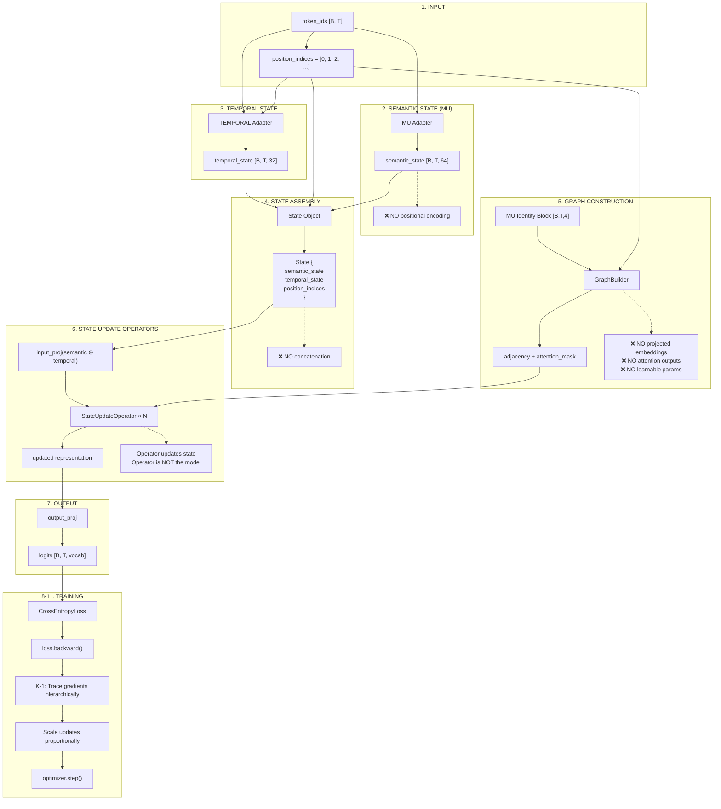

# Self-Organizing State Model — Formal Architecture

> **Document Purpose:** Formal specification of the SOSM execution flow, correcting conceptual errors that made it resemble a Transformer pipeline.

---

## Corrected Execution Flow



---

## Corrections and Justifications

### 1. Positional Encoding Removed from MU

**Error:** Positional encoding was added to semantic embeddings.

**Correction:** MU outputs **pure semantic identity** without position information.

**Justification:**
> "Semantic identity must remain invariant to sequence position."

The meaning of the word "cat" does not change based on where it appears in a sentence. Position is **temporal/structural** information, not semantic. It belongs in TEMPORAL, not MU.

```python
# WRONG (old)
M = self.token_to_mu(token_ids)
M = M + self.pos_encoding[:, :T, :]  # ❌

# CORRECT (new)
M = self.token_to_mu(token_ids)  # Pure semantic identity
# NO positional encoding added
```

---

### 2. Semantic and Temporal States Remain Separate

**Error:** `torch.cat([semantic_state, temporal_state])` in State object.

**Correction:** State carries semantic and temporal **separately**. They are only combined internally for computation.

**Justification:**
- Concatenation destroys interpretability
- Cannot independently analyze what each component contributes
- State should be human-readable

```python
# State object
State:
    semantic_state: [B, T, 64]      # MU output
    temporal_state: [B, T, 32]      # TEMPORAL output
    position_indices: [B, T]        # Explicit positions
    # NO combined_embedding() method
```

---

### 3. Graph Uses MU Identity Block + Positions Only

**Error:** GraphBuilder could access projected embeddings.

**Correction:** GraphBuilder receives ONLY:
- MU Identity block (first 4 elements of semantic_state)
- Explicit position indices

**Justification:**
- Graph is a **structural constraint**, not a learned component
- Must not see attention outputs (would create circular dependency)
- Must not learn parameters (graph defines what CAN be learned)

```python
# GraphBuilder inputs
mu_identity = state.get_mu_identity_block()  # [B, T, 4]
positions = state.position_indices           # [B, T]

# GraphBuilder DOES NOT see:
# - attention outputs
# - projected embeddings
# - any intermediate computations
```

---

### 4. State Update Operator (Not Transformer)

**Error:** Named `TransformerLayer`, implying the model IS a Transformer.

**Correction:** Renamed to `StateUpdateOperator` with explicit documentation.

**What the State Update Operator DOES:**
- Projects semantic + temporal states into computation space
- Applies attention under graph routing constraints
- Updates state via gated residuals

**What the State Update Operator DOES NOT DO:**
- Define the model architecture (State does)
- Learn positional patterns (TEMPORAL does)
- Modify semantic identity (MU is position-invariant)
- Act as "the model" (it's a computation primitive)

```python
class StateUpdateOperator(nn.Module):
    """
    Computation operator that updates State under constraints.
    
    This is NOT a Transformer layer. It uses attention mechanics
    as a computational primitive to update state.
    """
```

---

## Toggle Behavior

| Component | OFF Behavior |
|-----------|--------------|
| **Graph** | Unrestricted attention (full O(T²)) |
| **TEMPORAL** | No time dependence (semantic only) |
| **K-1** | Standard backprop (all params equal) |

Each component can be disabled independently:
- **Stage 0:** MU only
- **Stage 1:** MU + TEMPORAL
- **Stage 2:** MU + TEMPORAL + K-1
- **Stage 3:** Full system with graph routing

---

## Summary

| Aspect | Before (Wrong) | After (Correct) |
|--------|---------------|-----------------|
| MU output | Semantic + position | Pure semantic only |
| State internals | Concatenated tensor | Separate fields |
| Graph input | Full embeddings | MU Identity + positions |
| Layer naming | TransformerLayer | StateUpdateOperator |
| Model identity | "A better Transformer" | State-centric system |

**This is NOT a Transformer architecture.** It is a **state-centric system** that uses attention as one computational primitive among others.
